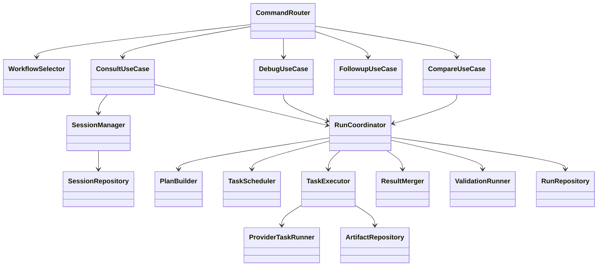

# Class Design For Run-Centric Ledger

## Historical Note
この文書は設計比較または実装履歴の資料であり、2026-03-11 時点の現行コード構成とは一部異なる。`WorkflowSelector`、`src/orchestrator/*`、`CompareUseCase` placeholder などへの言及は履歴として読むこと。

## Design Goal
この設計では、`Session` と `Run` を分けることで、会話継続と実行追跡を別責務にする。  
クラス設計の中心は `RunCoordinator` であり、orchestrator 要素はここに集約する。

phase 1 の concrete provider は `Claude Code` のみである。  
そのため `ProviderRegistry` は 1 実装だけを束ねる形から始めるが、境界自体は将来の追加に備えて残す。

## DDD Policy
ここで登場する継続的な業務概念は entity-first で扱う。  
`Session` だけでなく、`Run`, `RunTask`, `TaskResult`, `Artifact`, `ContextBundle`, `ProviderResponse`, `NormalizedResponse`, `ComparisonReport` まで entity としてそろえる。

ただし `ProviderRef`, `Usage`, `Citation`, `TaskDependency` のように同一性を持たないものは value object に留める。

## Core Classes

| Class | 役割 | 持つデータ | 主な依存先 |
|---|---|---|---|
| `AipanelApp` | アプリ全体の依存組み立て | config, repositories, registries | 全体 |
| `CommandRouter` | command を use case へ振り分ける | command spec | `WorkflowSelector`, use cases |
| `WorkflowSelector` | direct / orchestrated mode を決める | heuristics, flags | use cases |
| `ConsultUseCase` | 単発相談を調停する | request context | `SessionManager`, `RunCoordinator` |
| `DebugUseCase` | デバッグ相談を調停する | debug options | `ContextCollector`, `RunCoordinator` |
| `FollowupUseCase` | 既存 session への追加入力を扱う | session id, question | `SessionManager`, `RunCoordinator` |
| `CompareUseCase` | phase 2 以降の比較を扱う | provider list or review modes, question | `RunCoordinator`, `ComparisonEngine` |
| `SessionManager` | `Session` aggregate の作成・読み出し・turn 追加 | session metadata | `SessionRepository` |
| `RunCoordinator` | 1 `Run` aggregate の全工程を束ねる | run id, plan, status | planner/executor/merger/validator |
| `PlanBuilder` | task plan を作る | plan rules | `ContextCollector`, `ProviderRegistry` |
| `TaskScheduler` | task の順序と並列度を決める | task graph | `RunRepository` |
| `TaskExecutor` | task 実行を回す | execution status | `ProviderTaskRunner`, `ArtifactRepository` |
| `ProviderTaskRunner` | provider adapter を呼び出す | request payload | `ProviderRegistry` |
| `ResultMerger` | task 結果を統合する | merged findings | `ResponseNormalizer` |
| `ValidationRunner` | 結果の矛盾や不足を点検する | validation notes | `ProviderTaskRunner` |
| `ResultRenderer` | CLI 出力に整形する | output view model | use cases |

## Future Multi-Agent Role Classes
`05_multi-agent-job-orchestrator` の役割を追加する場合でも、別の大きな上位クラスを作るより、`RunCoordinator` 配下の役割クラスとして足す方がよい。

| Class | 対応する役割 | 主な責務 |
|---|---|---|
| `TaskPlanner` | planner | 問いを複数観点へ分解し `RunTask` を作る |
| `ContextCollectorTask` | collector | task ごとに必要な context を追加収集する |
| `ProviderReviewTask` | reviewer | phase 1 は Claude Code の観点別レビュー task、phase 2 以降は provider 別にも拡張する |
| `MergeTask` | merger | 複数 task result を統合する内部 task |
| `ValidationTask` | validator | merged result の再点検を表す内部 task |
| `RoleAssignmentPolicy` | role selection | どの command でどの役割を使うかを決める |

## Persistent Models

| Model | 役割 | 正本 |
|---|---|---|
| `Session` | 会話継続の aggregate root | `SessionRepository` |
| `SessionTurn` | `Session` 配下の child entity | `SessionRepository` |
| `Run` | 1 実行の aggregate root | `RunRepository` |
| `RunTask` | `Run` 配下 task の entity | `RunRepository` |
| `TaskResult` | task 実行結果の entity | `RunRepository` |
| `ContextBundle` | 収集 context の trace entity | `RunRepository` |
| `ProviderResponse` | provider 実行 trace entity | `RunRepository` |
| `NormalizedResponse` | 比較用の child entity | `RunRepository` |
| `Artifact` | 重いデータ参照の aggregate root | `ArtifactRepository` |
| `ComparisonReport` | compare の最終 entity | `RunRepository` または `ArtifactRepository` |

推奨する追加フィールドは以下である。

| Model | 追加したいフィールド |
|---|---|
| `RunTask` | `taskKind`, `role`, `provider`, `dependsOn`, `status` |
| `TaskResult` | `summary`, `findings`, `citations`, `confidence`, `sourceArtifacts` |
| `Run` | `mode`, `planVersion`, `finalSummary`, `validationStatus` |

## Dependency Rules
- use case は repository を直接またがず、`SessionManager` と `RunCoordinator` を通す
- `RunCoordinator` は `Session` を更新しない。session 更新は `SessionManager` に限定する
- `ProviderTaskRunner` は provider 差分だけを扱い、merge や validation を持たない
- `ResultRenderer` は `Run` と `ComparisonReport` から view model を作るだけに留める

## Recommended Package Direction

| Package | 主な型 |
|---|---|
| `src/app` | `AipanelApp`, `CommandRouter`, `WorkflowSelector` |
| `src/usecases` | `ConsultUseCase`, `DebugUseCase`, `FollowupUseCase`, `CompareUseCase` |
| `src/session` | `SessionManager`, `SessionRepository`, `Session`, `SessionTurn` |
| `src/run` | `RunCoordinator`, `RunRepository`, `Run`, `RunTask`, `TaskResult`, `ContextBundle`, `ProviderResponse`, `NormalizedResponse` |
| `src/orchestrator` | `PlanBuilder`, `TaskScheduler`, `TaskExecutor`, `ResultMerger`, `ValidationRunner` |
| `src/providers` | `ProviderRegistry`, `ProviderTaskRunner`, provider adapters |
| `src/context` | `ContextCollector` |
| `src/artifact` | `ArtifactRepository`, `Artifact` |
| `src/output` | `ResultRenderer` |

## Relationship Sketch

## Practical Note
最初に全クラスを concrete に作る必要はない。  
ただし `SessionManager`, `RunCoordinator`, `RunRepository` の 3 つは、早い段階で固定しておくと後の変更量が大きく減る。  
そのうえで phase 1 では entity 境界を先に固め、phase 2 で `TaskPlanner`, `ProviderReviewTask`, `ValidationTask` を足すのが安全である。
