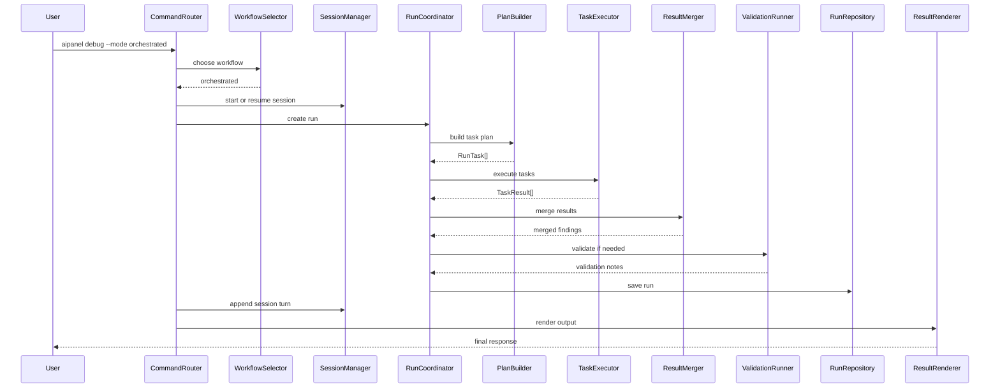

# Data Flow For Run-Centric Ledger

## Historical Note
この文書は設計比較または実装履歴の資料であり、2026-03-11 時点の現行コード構成とは一部異なる。`WorkflowSelector`、`src/orchestrator/*`、`CompareUseCase` placeholder などへの言及は履歴として読むこと。


## Goal
このフローでは、すべての command 実行が `Run` を作る。  
simple path でも complex path でも、内部の追跡単位を `Run` に揃えることで、データ保持と検証の仕方を統一する。

phase 1 の concrete provider は `Claude Code` のみである。  
そのため orchestrated mode でも、最初は multi-provider fan-out ではなく、Claude Code に対する複数観点 task として組み立てる。

## Shared Flow

1. `CommandRouter` が CLI 入力を `UserIntent` に変換する
2. `WorkflowSelector` が `direct` か `orchestrated` かを決める
3. `SessionManager` が session を開始または再開する
4. `RunCoordinator` が `Run` を作成する
5. `PlanBuilder` が task plan を組み立てる
6. `TaskScheduler` が task 順序を決める
7. `TaskExecutor` が provider call や helper task を実行する
8. `ResultMerger` が task 結果を統合する
9. `ValidationRunner` が必要なら再点検する
10. `RunRepository` が run 結果を保存する
11. `SessionManager` が session turn を更新する
12. `ResultRenderer` が CLI 出力を返す

## Direct Mode

```text
CommandRouter
  -> WorkflowSelector(direct)
  -> SessionManager
  -> RunCoordinator(create run)
  -> PlanBuilder(one simple task)
  -> TaskExecutor
  -> RunRepository(save completed run)
  -> SessionManager(save turn)
  -> ResultRenderer
```

### direct mode で持つもの
- `Run.status = completed`
- `RunTask` は通常 1 件
- raw response は `ArtifactRepository`
- summary は `Run.finalSummary`

## Orchestrated Mode

```text
CommandRouter
  -> WorkflowSelector(orchestrated)
  -> SessionManager
  -> RunCoordinator(create run)
  -> PlanBuilder(multiple tasks)
  -> TaskScheduler
  -> TaskExecutor(fan-out)
  -> ResultMerger
  -> ValidationRunner
  -> RunRepository(save report)
  -> SessionManager(save turn)
  -> ResultRenderer
```

### orchestrated mode で追加されるもの
- `RunTask[]`
- `TaskResult[]`
- `ComparisonReport` または `MergedFinding`
- `ValidationNote[]`

### orchestrated mode の役割マッピング
- planner: `PlanBuilder` / `TaskPlanner`
- collector: `ContextCollectorTask`
- reviewer: `TaskExecutor` -> `ProviderTaskRunner`
- merger: `ResultMerger`
- validator: `ValidationRunner`

この役割群は全部 `Run` 配下の task / phase として記録し、`Session` へ直接ぶら下げない。

## Run Status Transition

```text
created
  -> planned
  -> running
  -> merged
  -> validated
  -> completed

error cases
  -> failed
  -> partial
```

## Persistence Layout

| 保存先 | 主な内容 |
|---|---|
| `.aipanel/profile.yml` | 既定 provider、project 設定 |
| `.aipanel/sessions/<sessionId>.json` | session metadata, turns, provider refs |
| `.aipanel/runs/<runId>.json` | plan, task status, summaries, validation results |
| `.aipanel/artifacts/<runId>/...` | raw provider output, logs, diff bundle, exported comparison |

## Sequence Sketch



## Example Role Sequence
難しい `debug` を将来的に multi-agent 的に走らせる場合、`Run` の中では次の順序を想定する。

1. planner が `debug` の問いを観点へ分解する
2. collector がログ、差分、対象ファイルを集める
3. reviewer 群が phase 1 では観点別に、phase 2 以降は provider 別または観点別に並列評価する
4. merger が一致点と差分を統合する
5. validator が不足観点や再調査の必要性を確認する
6. 必要なら追加 task を積み増し、それでも十分なら `completed` に進める

## Final Note
この設計で重要なのは、`Session` と `Run` を混ぜないこと、そして provider 呼び出し結果を直接 session に押し込まないことである。  
`Run` が execution ledger、`Session` が conversation ledger、`Artifact` が heavyweight payload storage、という分担を守るのが要点である。
