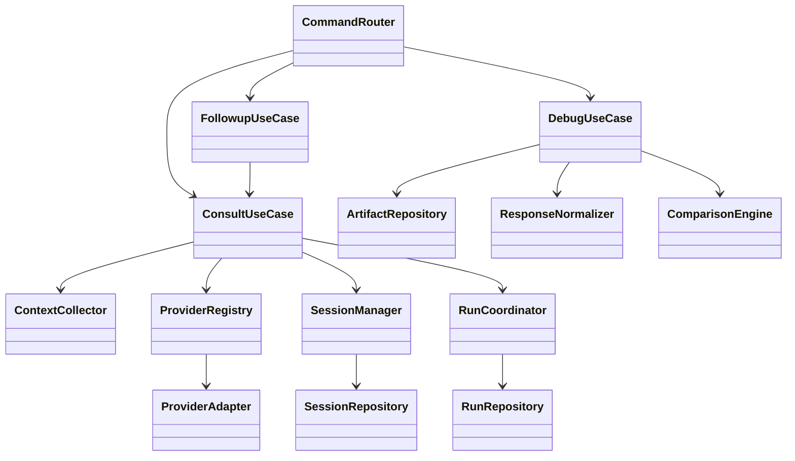

# Class Design

## Current Code Note
2026-03-11 時点の現行コードでは、専用の `WorkflowSelector`、`src/orchestrator/*`、phase 2 placeholder の `CompareUseCase` は存在しない。以下では current implementation と future option を分けて記す。

## Note
`CLI Broker` の一般設計だけでなく、`Broker + Orchestrator` の内部設計を 5 パターン比較した詳細版は [Broker + Orchestrator Internal Design](../../broker_orchestrator_design_2026-03-10/00_overview/00_overview.md) を参照する。

## Purpose
この文書は、[Recommended Architecture](../07_recommended-architecture/07_recommended-architecture.md) を実装へ落とすための責務設計を整理する。

ここでいう「クラス」は、将来の実装言語に依存しない責務単位を指す。  
ただし現時点の実装前提は TypeScript / Node.js なので、実際には `class` を基本にしつつ module function を補助的に使ってよい。重要なのは責務境界であり、構文そのものではない。

## Design Rules
- CLI 層は I/O と command dispatch のみを担当する
- ユースケース層が業務フローを所有する
- provider 固有仕様は adapter 層へ閉じ込める
- session と artifact は `aipanel` 側の永続化責務とする
- compare は raw provider output ではなく normalized domain model を入力にする
- 永続化される主要概念は entity として定義し、leaf value だけを value object にする

## DDD Modeling Policy
`aipanel` では、外から見える主要な継続概念を entity として扱う。  
`Session` だけを特別扱いせず、`Run`, `RunTask`, `TaskResult`, `Artifact`, `ContextBundle`, `ProviderResponse`, `NormalizedResponse`, `ComparisonReport` まで同じ方針でそろえる。

一方で、同一性を必要としない値は value object に分ける。  
これにより、domain model を TypeScript 実装へ落とすときも「ID を持つもの」と「値だけのもの」が明確になる。

## Commands And DTOs

| Name | 役割 | 主なフィールド |
|---|---|---|
| `UserIntent` | CLI から受け取る高レベル要求 | `command`, `question`, `targets`, `providerNames`, `options` |
| `ConsultationRequest` | 1 回の相談実行を表す | `intent`, `contextBundle`, `sessionRef`, `mode` |
| `ProviderCallPlan` | provider 呼び出し用の application DTO | `provider`, `prompt`, `sessionHint`, `timeout`, `mode` |

## Aggregate Roots And Entities

| Name | DDD Kind | 主なフィールド |
|---|---|---|
| `Session` | Aggregate Root | `sessionId`, `title`, `status`, `createdAt`, `updatedAt`, `providerRefs`, `turns` |
| `SessionTurn` | Child Entity | `turnId`, `sessionId`, `role`, `content`, `artifactIds`, `createdAt` |
| `Run` | Aggregate Root | `runId`, `sessionId`, `command`, `mode`, `status`, `planVersion`, `createdAt`, `updatedAt` |
| `RunTask` | Child Entity | `taskId`, `runId`, `taskKind`, `role`, `provider`, `dependsOn`, `status` |
| `TaskResult` | Child Entity | `resultId`, `taskId`, `summary`, `findings`, `citations`, `confidence`, `sourceArtifactIds` |
| `ContextBundle` | Trace Entity | `contextId`, `runId`, `summary`, `files`, `diffs`, `logs`, `metadata` |
| `ProviderResponse` | Trace Entity | `responseId`, `taskId`, `provider`, `rawTextRef`, `rawJsonRef`, `usage`, `latencyMs`, `externalRefs` |
| `NormalizedResponse` | Child Entity | `normalizedResponseId`, `taskId`, `provider`, `summary`, `findings`, `suggestions`, `citations`, `confidence` |
| `Artifact` | Aggregate Root | `artifactId`, `kind`, `path`, `sessionId`, `runId`, `turnId`, `createdAt` |
| `ComparisonReport` | Entity | `reportId`, `runId`, `topic`, `responseIds`, `agreements`, `differences`, `recommendation` |

## Value Objects

| Name | 役割 | 主なフィールド |
|---|---|---|
| `ProviderRef` | provider native session への参照 | `provider`, `providerSessionId`, `workingDirectory`, `lastUsedAt` |
| `Usage` | token / cost / latency のまとまり | `inputTokens`, `outputTokens`, `costUsd`, `latencyMs` |
| `Citation` | finding の根拠参照 | `kind`, `label`, `pathOrUrl`, `line` |
| `TaskDependency` | task 間依存 | `taskId`, `dependencyTaskId` |
| `FileRef` | 収集対象ファイル | `path`, `purpose`, `checksum` |
| `DiffRef` | 差分参照 | `path`, `range`, `summary` |
| `LogRef` | ログ参照 | `path`, `source`, `capturedAt` |
| `ConfidenceScore` | confidence の標準表現 | `level`, `reason` |
| `ExternalRef` | provider や外部 tool の補助 ID | `system`, `id`, `scope` |

## Application Services

| Service | 役割 | 主な依存先 |
|---|---|---|
| `ConsultUseCase` | 単発相談を実行する | `ContextCollector`, `ProviderRegistry`, `SessionManager`, `RunCoordinator`, `ArtifactRepository` |
| `DebugUseCase` | 複数 role の debug 相談を実行する | `ContextCollector`, `ArtifactRepository`, `ProviderRegistry`, `SessionManager`, `RunCoordinator`, `ComparisonEngine` |
| `FollowupUseCase` | 既存 session に続けて問い合わせる | `ConsultUseCase` |
| `ListProvidersUseCase` | 利用可能 provider を一覧表示する | `ProviderRegistry` |

## Coordinators And Support Objects

| Name | 役割 |
|---|---|
| `CommandRouter` | CLI command を適切なユースケースへ振り分ける |
| `ProfileLoader` | `.aipanel/profile.yml` を読み、既定 provider や project 設定を解決する |
| `ContextCollector` | ファイル、差分、ログ、対象パスを集めて `ContextBundle` を組み立てる |
| `ProviderRegistry` | provider 名から adapter を解決する |
| `ResponseNormalizer` | provider ごとの返答を `NormalizedResponse` に変換する |
| `ComparisonEngine` | 複数 `NormalizedResponse` から一致点と差分を作る |
| `SessionManager` | `Session` aggregate の生成、turn 追加、resume を調停する |
| `RunCoordinator` | `Run` aggregate と `RunTask` 実行を調停する |
| `ResultRenderer` | terminal / JSON 向けに結果を整形する |

## Ports / Interfaces

| Port | 目的 |
|---|---|
| `ProviderAdapter` | `Call(plan) -> ProviderResponse` を提供する |
| `SessionRepository` | `Session` の保存・取得・検索を担当する |
| `RunRepository` | `Run`, `RunTask`, `TaskResult`, `ContextBundle`, `NormalizedResponse` の保存・取得を担当する |
| `ArtifactRepository` | ログや比較結果などの artifact を保存する |
| `ContextSource` | git diff、file read、log read などの入力源を抽象化する |
| `Clock` | 時刻取得を抽象化してテストしやすくする |
| `IdGenerator` | session / turn / artifact ID を安定生成する |

## Optional Phase-Two Objects
この節のオブジェクトは将来案であり、2026-03-11 時点の現行コードには存在しない。

| Name | 役割 |
|---|---|
| `JobOrchestrator` | multi-agent フロー全体の親制御を担う |
| `TaskPlanner` | 相談内容を複数観点へ分解する |
| `FanOutExecutor` | 複数 provider / 複数役割の呼び出しを束ねる |
| `ResultMerger` | 並列結果を統合し最終結論へ寄せる |
| `ValidationRunner` | 結論の矛盾や不足を再点検する |

## Dependency Direction
依存方向は常に次の一方向に揃える。

```text
CLI
  -> use case
      -> domain model
      -> ports
          -> infrastructure adapters
```

重要なのは、`ProviderAdapter` 実装から `ConsultUseCase` へ逆依存しないこと、`ResultRenderer` が provider 固有レスポンスを直接解釈しないことである。

## Suggested Package Mapping

| Package | 主な型 |
|---|---|
| `src/app` | `CommandRouter`, `ProfileLoader` |
| `src/usecases` | `ConsultUseCase`, `DebugUseCase`, `FollowupUseCase`, `ListProvidersUseCase` |
| `src/domain` | `Session`, `SessionTurn`, `Run`, `RunTask`, `TaskResult`, `ContextBundle`, `ProviderResponse`, `NormalizedResponse`, `Artifact`, `ComparisonReport`, value objects |
| `src/context` | `ContextCollector`, `ContextSource` 実装 |
| `src/providers` | `ProviderRegistry`, `ProviderAdapter` 実装群 |
| `src/session` | `SessionManager`, `SessionRepository` 実装 |
| `src/run` | `RunCoordinator`, `RunRepository` 実装 |
| `src/artifact` | `ArtifactRepository` 実装 |
| `src/compare` | `ResponseNormalizer`, `ComparisonEngine` |
| `src/output` | `ResultRenderer` |

## Relationship Sketch



## Implementation Note
最初に全部を実装する必要はない。  
ただし `Session`, `Run`, `RunTask`, `ContextBundle`, `ProviderResponse`, `NormalizedResponse` の 6 つは、あとから compare や follow-up を足す前提で早めに entity 形を決めておく方がよい。
