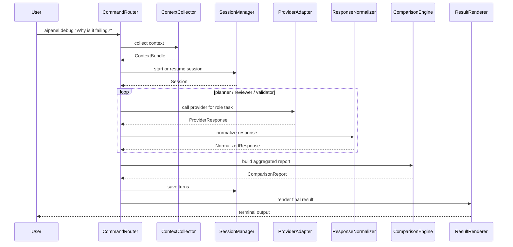

# Data Flow

## Current Code Note
2026-03-11 時点の現行コードでは `compare` command は存在せず、orchestrated flow は `debug` の内部実装として扱う。専用の `WorkflowSelector` や `src/orchestrator/*` も存在しない。

## Note
`Broker + Orchestrator` 前提の詳細な実行フローは [Broker + Orchestrator Internal Design](../../broker_orchestrator_design_2026-03-10/00_overview/00_overview.md) を参照する。

## Purpose
この文書は、`aipanel` の推奨構成において、CLI 入力から provider 呼び出し、session 保存、比較結果の出力までをどう流すかを定義する。

## Common Pipeline
すべてのコマンドは、概ね次の流れを共有する。

1. `CommandRouter` が CLI 入力を `UserIntent` に変換する
2. `CommandRouter` が `provider` / `model` / `timeoutMs` を補完し、必要に応じて `ContextCollector` と共にユースケースへ渡す
3. `SessionManager` が新規 session 作成または既存 session 読み出しを行う
4. `ProviderRegistry` が対象 provider の adapter を解決する
5. ユースケースが `ProviderCallPlan` を組み立てる
6. `ProviderAdapter` が実行され、`ProviderResponse` を返す
7. 必要に応じて `ResponseNormalizer` と `ComparisonEngine` が後処理を行う
8. `SessionRepository` / `ArtifactRepository` が結果を保存する
9. `ResultRenderer` が terminal / JSON 向けに結果を返す

## Flow 1: consult

```text
user command
  -> CommandRouter
  -> ConsultUseCase
  -> ContextCollector
  -> SessionManager(start or resume)
  -> ProviderRegistry
  -> ProviderAdapter
  -> SessionRepository(save turn)
  -> ResultRenderer
  -> terminal output
```

### consult で保存するもの
- 入力質問
- 収集した `ContextBundle` の要約
- provider ごとの raw response
- normalized response
- 最終表示用の summary

## Flow 2: followup

```text
user command with session id
  -> CommandRouter
  -> FollowupUseCase
  -> SessionRepository(load session)
  -> SessionManager(append user turn)
  -> ProviderRegistry
  -> ProviderAdapter(with session hint)
  -> SessionRepository(save assistant turn)
  -> ResultRenderer
```

### followup の重要点
- follow-up は provider 依存ではなく `Session` 依存で扱う
- provider 固有 thread ID は `providerRefs` として session に保持する
- resume できない provider は `aipanel` 側の turn 履歴から再構築する

## Flow 3: debug

```text
user command with logs / files / question
  -> CommandRouter
  -> DebugUseCase
  -> ContextCollector
  -> SessionManager(start or resume)
  -> ProviderRegistry
  -> ProviderAdapter(role-based repeated calls)
  -> ResponseNormalizer
  -> ComparisonEngine
  -> SessionRepository(save turns)
  -> ArtifactRepository(save debug artifacts)
  -> ResultRenderer
```

### debug で追加したい扱い
- 入力ログや失敗ケースを artifact として保存する
- provider へ送った context の抜粋を再現可能にする
- 後から `followup` で「どのログが使われたか」を辿れるようにする

## Error And Retry Flow
- `ProviderAdapter` の失敗は provider 単位で記録する
- debug 実行時は、一部 task が失敗しても部分成功として扱えるようにする
- timeout と retry は `ProviderCallPlan` に含める
- session 保存は provider 実行後だけでなく、開始時にも最低限の metadata を残す

## Persistence Points

| タイミング | 保存対象 |
|---|---|
| command 受付直後 | session metadata, intent summary |
| context 収集後 | context summary, artifact refs |
| provider 応答後 | raw response, normalized response |
| debug 集約後 | comparison report |
| renderer 出力直前 | final summary, exit status |

## Sequence Sketch



## Data Contract Notes
- `ContextBundle` は provider ごとの prompt 断片ではなく、ユースケース中立の中間形式にする
- `ProviderResponse` と `NormalizedResponse` を分けることで、adapter 変更が compare に波及しにくくなる
- `Session` には表示結果だけでなく、再現に必要な最小 metadata を残す

## Final Note
データフロー上で一番重要なのは、`provider call` を中心に設計しないことである。  
`aipanel` が owning application として session と artifact を持ち、その一部工程として provider を呼ぶ構図を崩さないことが、後の拡張を最も楽にする。
