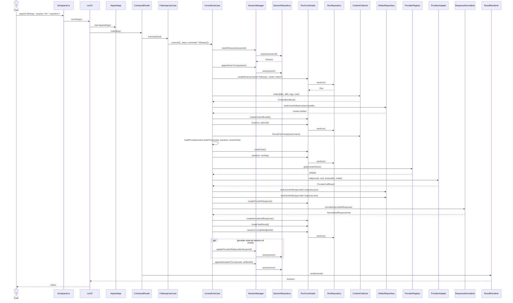
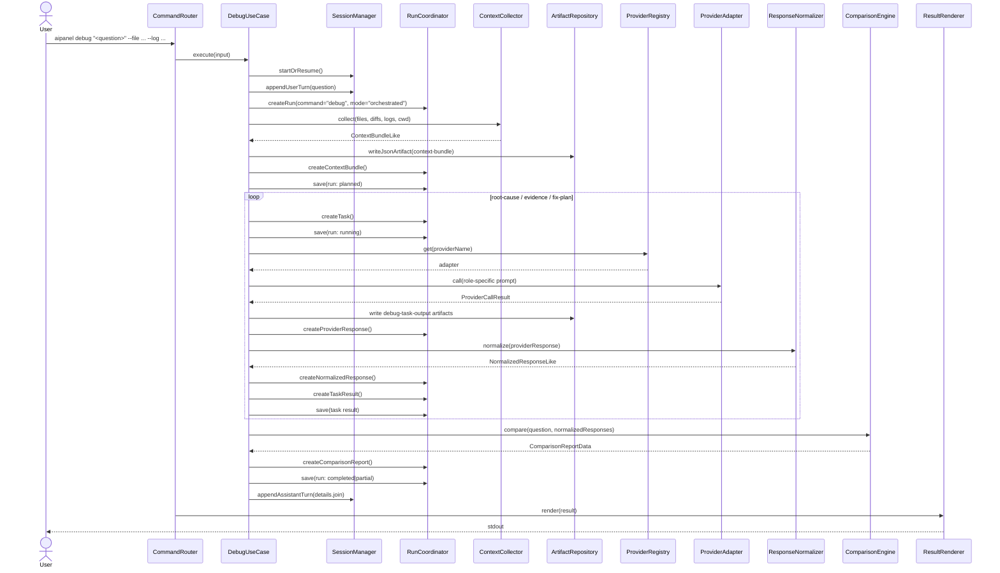

# Current Conversation And Data Flow

対象スコープ: phase 1 の現行 TypeScript 実装。

このドキュメントは、`aipanel` の現行データフローを「継続会話」と「呼び出し鎖」の観点でまとめた companion doc です。既存の SVG 図よりも、実装の入口と保存点を文章で追いやすくすることを目的にしています。

## Short Answer

- `aipanel` 経由で継続会話はできる。
- ただし実態は provider native resume を正本にする方式ではない。
- `aipanel` 自身が `Session` を保存し、`followup --session <id>` で履歴を再構築して再度 provider を呼ぶ。
- provider の `session_id` や `thread_id` は `ProviderRef` として保存されるが、現行 phase 1 実装では resume の正本には使っていない。

## Core Data Ownership

現行実装で正本になっているデータは以下です。

- `Session`
  - 会話単位の履歴
  - `turns[]` と `providerRefs[]` を保持する
- `Run`
  - 1 回の command 実行単位の ledger
  - `tasks[]`、`taskResults[]`、`contextBundles[]`、`providerResponses[]`、`normalizedResponses[]`、`comparisonReports[]` を保持する
- `Artifact`
  - context snapshot、raw provider response、debug task output をファイルとして保持する

要するに、会話の継続は provider 側のセッションではなく、`aipanel` 側の `Session` と `Run` を基準に実現しています。

## Entry Points And Call Chain

現行の入口から出口までの呼び出し鎖は次の通りです。

1. `bin/aipanel.ts`
   - `runCli()` を呼ぶ CLI entrypoint
2. `src/cli/aipanel.ts`
   - `AipanelApp` と `CommandRouter` を生成して route する
3. `src/app/AipanelApp.ts`
   - repository、manager、coordinator、provider adapter、use case を配線する composition root
4. `src/app/CommandRouter.ts`
   - 引数を解釈し、`provider` / `model` / `timeoutMs` を補完して `consult` / `followup` / `debug` の use case を選ぶ
5. `src/usecases/*.ts`
   - session 作成、context 収集、run 作成、provider 実行、正規化、保存を進める
6. `src/output/ResultRenderer.ts`
   - text/json に整形して CLI に返す

## Direct Mode: Consult And Followup

`consult` と `followup` は direct mode です。

- `followup` は独立した別処理ではなく、`ConsultUseCase.execute()` に `command: "followup"` を渡す薄い wrapper
- session 継続の実態は `SessionManager.startOrResume()` と `Session.buildTranscript()` にある
- prompt は次の 3 要素で組み立てられる
  - `Conversation so far`
  - `Additional context`
  - `Current question`

### Sequence

### Why This Counts As Continuous Conversation

継続会話として成立している理由は、`followup` のたびに以下をやっているからです。

1. 既存 `Session` を `sessionId` で読み戻す
2. `turns[]` から transcript を再構築する
3. 新しい user turn を追加する
4. transcript と context を含んだ prompt を provider に送る
5. provider の返答を assistant turn として session に保存する

つまり「1 本の native socket/session を保持し続ける」のではなく、「保存済み履歴を使って次回呼び出し時に文脈を再構築する」設計です。

### Important Note On ProviderRef

`Claude Code` の `session_id` や `Codex` の `thread_id` は adapter から `externalRefs` として返され、`ProviderRef` として session に保存されます。

ただし現行コードでは:

- resume 時に `ProviderRef` を使って provider native session を再開していない
- `followup` の継続性は `Session.buildTranscript()` に依存している

したがって phase 1 の意味では、`ProviderRef` は「外部系の参照情報」であって、「継続会話の正本」ではありません。

## Debug Mode: Orchestrated Flow

`debug` は direct mode ではなく orchestrated mode です。

- session と run を先に作る
- `root-cause`、`evidence`、`fix-plan` の 3 task を順番に provider へ投げる
- 各 task ごとに raw response と normalized response を run に積む
- 最後に `ComparisonEngine` で recommendation をまとめる

### Sequence

## Persistence Points

現行実装での主要な保存点は以下です。

| タイミング | 保存先 | 内容 |
|---|---|---|
| session 開始または再開直後 | `.aipanel/sessions/<sessionId>.json` | session metadata |
| user turn 追加後 | `.aipanel/sessions/<sessionId>.json` | 最新の会話履歴 |
| run 作成直後 | `.aipanel/runs/<runId>.json` | command, mode, status |
| context 収集後 | `.aipanel/artifacts/<runId>/...` | context bundle artifact |
| provider 応答後 | `.aipanel/artifacts/<runId>/...` | raw text/json artifact |
| provider 応答後 | `.aipanel/runs/<runId>.json` | provider response, normalized response, task result |
| assistant turn 追加後 | `.aipanel/sessions/<sessionId>.json` | 継続会話に使う最新 transcript |

## Reading Guide

コードを読むときは、次の順で追うと把握しやすいです。

1. `bin/aipanel.ts`
2. `src/cli/aipanel.ts`
3. `src/app/AipanelApp.ts`
4. `src/app/CommandRouter.ts`
5. `src/usecases/FollowupUseCase.ts`
6. `src/usecases/ConsultUseCase.ts`
7. `src/usecases/DebugUseCase.ts`
8. `src/session/SessionManager.ts`
9. `src/domain/session.ts`
10. `src/run/RunCoordinator.ts`
11. `src/providers/*.ts`
12. `src/artifact/ArtifactRepository.ts`

## Final Note

現行 `aipanel` の中心は「provider をどう呼ぶか」よりも、「`aipanel` 自身が session / run / artifact をどう保持するか」です。

この前提で見ると、

- `consult` は単発相談
- `followup` は transcript 再構築型の継続会話
- `debug` は複数 task を run ledger に積む orchestrated flow

という役割分担がはっきり見えます。
